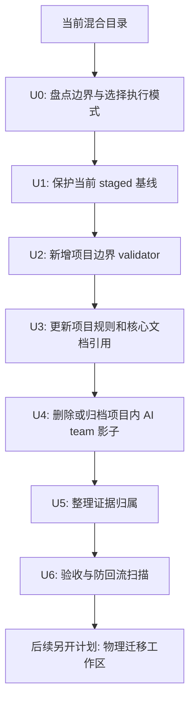

# refactor: 工作树边界确认与项目收敛

## Summary

本计划先把当前混合工作区整理成可决策、可回滚、可验收的状态：先保护现有大规模 staged 清理成果，再在原路径内收敛 Job Sprint 项目边界，把项目内的 AI 团队影子入口最小化。物理移动仓库、重排职业工作区顶层、改造全局 `codex-ai-team` 本体都不在本计划直接执行范围内。

---

## Problem Frame

当前仓库根目录承载 Job Sprint 应用本体，同时还保留 `.codex/agents/`、`docs/ai-team/`、`tools/ai_team_*`、`tests/ai_team_*` 等项目级 AI 团队机制文件。用户的真实诉求是让工作树边界清楚：AI 团队是全局能力，Job Sprint 是一个普通项目，职业资料、学习资料、项目代码和全局工具不应继续互相混淆。

---

## Assumptions

*本计划在未进行同步确认的情况下编写。以下是基于当前工作树和用户表达做出的规划假设，执行前应快速复核。*

- 当前大规模 staged 变更代表上一轮文档瘦身和代码治理成果，任何路径迁移或删除前都必须先保护这条基线。
- 默认执行模式是“原路径概念清理”：不移动仓库物理位置，只在当前项目内把边界和入口收敛清楚。
- `CODEX_HOME/skills/codex-ai-team/` 与 `CODEX_HOME/agents/codex-ai-team/` 已是全局 AI 团队本体；本计划不改造它们，只确保 Job Sprint 不再维护完整副本。
- `docs/ai-team/` 里的历史审计和 approvals 有证据价值，但不应继续作为 Job Sprint 当前主文档或团队本体存在。

---

## Requirements

- R1. 明确三层边界：职业工作区、Job Sprint 项目、全局 Codex AI 团队。
- R2. 先保护当前 staged 基线，禁止把上一轮大规模清理和本轮边界迁移混在同一个回滚面。
- R3. Job Sprint 项目内不再维护完整 AI 团队本体；只保留最小全局团队调用说明和项目验证口径。
- R4. 移除项目级 AI 团队影子入口前，必须先替换会被 `npm test` 依赖的验证门禁。
- R5. 当前事实源、历史摘要、当前验收证据和本地临时状态必须有清楚归属；全局团队运行证据只需明确不归属 Job Sprint，具体归属留给后续全局团队计划。
- R6. 边界清理后 Job Sprint 仍能运行项目测试、release gate、敏感扫描和工作树边界扫描。
- R7. 物理移动仓库必须等待用户确认和 clean worktree，不作为本计划默认执行动作。

---

## Scope Boundaries

- 不在本计划内移动整个 Git 仓库到新物理路径；只产出迁移前置条件和候选拓扑。
- 不在本计划内重构 Job Sprint 业务代码、UI、Android 架构或后端 runtime 数据模型。
- 不在本计划内产品化全局 Codex AI 团队、迁移全局 schema、改造 `CODEX_HOME` 脚本或新增全局运行证据仓。
- 不恢复旧 `docs/product`、`docs/qa`、`docs/ops`、大量截图报告或一次性历史目录。
- 不直接删除唯一证据；删除前必须有处置清单、归档摘要、承接位置或明确废弃依据。

### Deferred to Follow-Up Work

- 物理工作区重排：在 clean worktree 且用户确认后，再把 Job Sprint 作为职业工作区下的 `projects/job-sprint` 项目处理。
- 全局 AI 团队产品化：单独规划 `CODEX_HOME/skills/codex-ai-team/` 的文档、脚本、schema 和验收体系。
- Job Sprint 架构治理：`apps/server/app.js` 拆分、runtime JSON 并发治理、Android remote 安全强化另开计划。
- 职业资料管理系统化：简历版本、投递记录、学习资料索引等在项目边界清楚后再规划。
- 生成物发布策略：`dist/` 是否作为发布快照跟踪、是否改 `.gitignore`，另开发布资产治理计划处理。

---

## Context & Research

### Relevant Code and Patterns

- `package.json` 当前仍包含 `validate:ai-team`、`ai-team:start`、`ai-team:record`、`ai-team:baseline` 等项目级团队脚本。
- 当前 `npm test` 会检查并运行 `tools/ai_team_*` 和 `tests/ai_team_*`，因此不能先删这些文件再补门禁。
- `.codex/agents/` 当前存在项目级兼容角色，但全局角色已经存在于 `CODEX_HOME/agents/codex-ai-team/`。
- `docs/ai-team/` 当前包含 Team Room 协议、角色记忆、审计准则、handoff schema、本地运行记录和 approvals，体量已经超过“项目适配层”。
- `docs/core/` 当前是 Job Sprint 核心事实源，应继续作为项目文档主入口。
- `apps/` 是项目本体主要体量来源；`dist/` 是生成物，本计划不改变其跟踪策略，只验证边界清理不破坏现有 release gate。

### Institutional Learnings

- Job Sprint 的路由、鉴权、部署脚本和文档必须同轮收口，否则会出现代码已变、文档仍讲旧路径的漂移。
- 全局团队入口应是 Codex 可调用团队能力，不能再由单个项目里的 npm 脚本或 handoff 文件冒充。

### External References

- 未使用外部资料。本计划是本地工作树边界治理，当前证据来自工作树状态、目录结构和已有全局 Codex 配置。

---

## Key Technical Decisions

- 默认先做原路径概念清理：先让当前仓库内部边界正确，再考虑物理移动。
- 基线保护是硬门槛：当前 staged 大 diff 必须先形成独立审查面；patch bundle 只能作为恢复备份，不能单独授权继续在同一个 index 上追加 U2-U6。
- 先替换门禁，再删除 AI team 影子文件：先新增工作树边界验证的过渡模式并从 `npm test` 中移除 `ai_team_*` 依赖，删除完成后再启用不存在断言的强制模式。
- 不在本计划修改 `CODEX_HOME`：如果全局团队需要吸收 validator、schema 或运行证据，另开全局团队计划。
- 证据按归属矩阵处理：当前项目验收证据、历史摘要和本地临时状态不能混放；全局团队运行记录只标明不属于 Job Sprint。

---

## Evidence Ownership Matrix

| 资料类型 | 归属位置 | 处理规则 |
|---|---|---|
| Job Sprint 当前事实源 | `docs/core/` | 保留并作为唯一当前事实源；`docs/README.md` 和 `AGENTS.md` 只是入口/规则索引，必须指向核心文档、归档索引、当前计划和必要证据。 |
| Job Sprint 当前验收证据 | `docs/evidence/`，仅在确有最新证据需要保留时创建 | 只保留被 `docs/core/04-acceptance-and-risk.md` 引用的关键证据。 |
| 旧 AI 团队项目适配历史 | `docs/archive/index.md` 或 `docs/archive/ai-team-adapter-index.md` | 浓缩为摘要和承接说明，不保留完整团队本体。 |
| 全局 AI 团队运行证据 | 不归属 Job Sprint；后续全局团队计划决定 | 本计划只确认项目文档不把这类证据写入 Job Sprint，也不写入 `CODEX_HOME` 新证据目录。 |
| 本地 handoff、baseline、team-runs、evidence-ledger | `.gitignore` 忽略或删除 | 不进入 Job Sprint 当前事实源。 |
| 生成物 `dist/` | 沿用当前 release 策略 | 本计划不改跟踪策略，只通过 release gate 证明边界清理未破坏生成物流程。 |

---

## Execution Modes

| 模式 | 本计划是否执行 | 前置条件 | 成功口径 |
|---|---:|---|---|
| 原路径概念清理 | 是，默认 | 当前 staged 基线已保护 | 当前路径内项目边界清晰，AI 团队本体不再由 Job Sprint 维护。 |
| 物理迁移到职业工作区 | 否，后续计划 | 用户确认、clean worktree、旧路径依赖扫描完成 | 本计划停止并记录为后续计划输入，不在 U1-U6 内执行物理移动。 |
| 全局 AI 团队产品化 | 否，后续计划 | 明确全局团队目标与验收口径 | `CODEX_HOME` 下团队文档、脚本、schema 和证据体系独立可用。 |

本计划唯一可继续实施的模式是“原路径概念清理”。如果用户要求物理迁移，U0 只记录需求和前置条件，然后停止本计划并另开物理迁移计划。

---

## Output Structure

本计划默认目标是“当前项目内收敛”。物理迁移只是候选最终拓扑，不在本计划直接移动文件。

```text
current-job-sprint-project/
  README.md
  AGENTS.md
  package.json
  apps/
    server/
    react-web/
    android/
  assets/
  data/
  docs/
    README.md
    core/
    archive/
    evidence/              # 可选，仅保留当前关键验收证据
    plans/
  tools/
    validate_workspace_boundaries.js
  tests/
    workspace_boundaries_test.js

CODEX_HOME/
  skills/
    codex-ai-team/         # 已存在，本计划不改造
  agents/
    codex-ai-team/         # 已存在，本计划不改造
```

后续物理迁移候选拓扑：

```text
career-workspace/
  README.md
  projects/
    job-sprint/
  learning-materials/
  resume/
  outputs/
```

---

## High-Level Technical Design

> *This illustrates the intended approach and is directional guidance for review, not implementation specification. The implementing agent should treat it as context, not code to reproduce.*



---

## Implementation Units

### U0. 边界盘点与执行模式确认

**Goal:** 在改动前确认当前工作树真实状态、外部路径依赖和执行模式，避免未确认就进入物理迁移。

**Requirements:** R1, R7

**Dependencies:** None

**Files:**
- Review: `AGENTS.md`
- Review: `package.json`
- Review: `docs/README.md`
- Review: `docs/core/`
- Optional create: `docs/archive/workspace-boundary-inventory.md`
- Review: `.codex/agents/`
- Review: `docs/ai-team/`
- Review: `tools/`
- Review: `tests/`

**Approach:**
- 输出当前边界 inventory：项目本体、全局团队影子、历史证据、生成物、本地临时状态。
- 输出边界决策记录：职业资料、简历、学习资料、求职输出归为 Job Sprint 外部工作区输入，本计划只记录归属，不移动这些资料。
- 产出两种候选拓扑：本计划执行的原路径概念清理、后续计划才处理的物理迁移。
- 物理迁移一旦被用户提出，本计划停止在 U0：只记录请求和前置条件，不进入 U1-U6。

**Patterns to follow:**
- 当前 `docs/core/` 的核心事实源模式。

**Test scenarios:**
- Happy path：inventory 能清楚列出每类文件的归属和下一步处理方式。
- Edge case：发现硬编码旧路径时，只记录为物理迁移前置项，不立即改路径。
- Error path：如果用户要求物理迁移，本计划停止并转入后续计划，不移动 Git 仓库或顶层目录。

**Verification:**
- 执行模式明确为“原路径概念清理”。
- 若用户确认物理迁移，已记录为后续计划输入，并停止本计划。
- 没有发生目录移动。

---

### U1. 保护当前 staged 基线

**Goal:** 先把上一轮大规模文档瘦身和代码治理成果固定为独立回滚面，再允许进入边界清理。

**Requirements:** R2

**Dependencies:** U0

**Files:**
- Review: staged diff
- Review: `docs/core/`
- Review: `docs/archive/index.md`
- Review: `apps/server/app.js`
- Review: `tools/ai_team_validate.js`
- Review: `tests/api_runtime_test.js`
- Review: `package.json`
- Review: `docs/plans/2026-07-03-001-refactor-workspace-boundaries-plan.md`

**Approach:**
- 明确“固定基线”的含义：首选独立 commit；如果暂不提交，只能创建可恢复 patch bundle 并停止实施，等待用户确认如何分离工作树。
- 当前计划文件应明确归属：要么随规划提交单独纳入，要么从上一轮清理基线中排除。
- patch bundle 只能作为恢复备份，不能单独授权继续在同一个 staged diff 上追加 U2-U6。
- patch bundle 路径最低验收：使用包含二进制和 full-index 信息的 staged diff；记录 `git status --short`、staged name-status、untracked 清单和 SHA256；bundle 存在仓库外或明确不会被后续清理影响；在临时 worktree/clone 中验证可 apply/check 或可反向恢复。
- 若存在未验收删除、未暂存计划文件、无可恢复备份或没有独立审查面，禁止进入 U2-U6。

**Patterns to follow:**
- 之前 `PASS_WITH_LIMITS` 的验证证据：`npm test`、release gate、敏感扫描和旧路径扫描；全局团队只保留为 Codex 对话层 preflight 证据。

**Test scenarios:**
- Happy path：基线已独立 commit，index 干净，可单独审查和回滚。
- Edge case：计划文件是新文件时，不把它误算进上一轮质量治理成果。
- Error path：只有 patch bundle 但未分离工作树、存在未归属 untracked 文件或混入新边界清理动作时，停止后续实施。

**Verification:**
- 当前基线有独立恢复点和独立审查面。
- 工作树状态、staged 清单和计划文件归属已经记录。

---

### U2. 替换项目级 AI team 门禁

**Goal:** 在删除项目内 AI team 文件之前，先建立 Job Sprint 自己的工作树边界验证门禁。

**Requirements:** R3, R4, R6

**Dependencies:** U1

**Files:**
- Create: `tools/validate_workspace_boundaries.js`
- Create: `tests/workspace_boundaries_test.js`
- Modify: `package.json`
- Modify: `tests/`

**Approach:**
- 新增项目边界 validator，并支持 `audit` 与 `enforce` 两种模式。
- U2 只启用过渡门禁：`npm test` 先切换到新的工作树边界验证，不再依赖 `tools/ai_team_*` 和 `tests/ai_team_*`；此时 validator 对当前仍存在的 `.codex/agents/`、`docs/ai-team/`、`tools/ai_team_*`、`tests/ai_team_*` 只能输出 expected-fail/audit 结果，不能作为硬通过条件。
- 过渡门禁的硬失败范围只覆盖当前入口误指向本地团队本体、allowlist 之外新增旧路径、以及回流 fixture。
- U4 删除完成后，U6 再把不存在断言切到 `enforce` 模式。
- validator 应检查 forbidden pattern 和 allowlist：历史说明可在归档索引或计划文档中出现，当前项目入口不可再指向本地团队本体。

**Patterns to follow:**
- 现有 `tools/scan_sensitive_content.js` 和路径校验脚本的“脚本 + 测试 + package gate”模式。

**Test scenarios:**
- Happy path：过渡模式下，当前旧团队影子被记录为 expected-fail/audit，不阻断 `npm test` 替换。
- Enforce path：U4 删除后，没有 `.codex/agents/`、`docs/ai-team/`、`tools/ai_team_*.js`、`tests/ai_team_*_test.js` 时验证通过。
- Edge case：`docs/archive/index.md` 或当前计划中作为历史说明出现旧路径，验证允许。
- Error path：`AGENTS.md` 或 `docs/README.md` 把 `docs/ai-team/` 当当前入口时验证失败。
- Integration：`npm test` 不再因删除 `ai_team_*` 文件而失败。

**Verification:**
- 项目测试使用新的边界门禁。
- 删除旧 AI team 项目文件前，新的过渡门禁已经能捕获当前入口误指向和新回流风险；不存在断言尚未作为硬门禁启用。

---

### U3. 更新项目规则与核心文档入口

**Goal:** 在删除 `docs/ai-team/` 前，先把当前项目规则和核心文档改成“调用全局团队，不维护本地团队本体”的口径。

**Requirements:** R1, R3, R5

**Dependencies:** U2

**Files:**
- Modify: `AGENTS.md`
- Modify: `docs/README.md`
- Modify: `docs/core/01-project-background.md`
- Modify: `docs/core/02-project-plan.md`
- Modify: `docs/core/03-technical-architecture.md`
- Modify: `docs/core/04-acceptance-and-risk.md`

**Approach:**
- `AGENTS.md` 只保留最小项目适配：AI 团队入口是全局 skill，Job Sprint 只提供项目测试和文档边界。
- `docs/README.md` 移除 `ai-team/` 作为当前支撑文档入口。
- 核心文档保留一条风险边界：全局 AI 团队可调用，但 Job Sprint 不承担团队本体维护。
- 所有本地团队运行留痕路径从当前事实源中移除或标为历史。

**Patterns to follow:**
- `docs/core/` 的当前事实源写法。

**Test scenarios:**
- Happy path：用户从 README 和 AGENTS 能理解 Job Sprint 是项目、AI 团队是全局能力。
- Edge case：文档需要提到历史 `docs/ai-team/` 时，只出现在归档语境。
- Error path：任何当前入口要求写入 `docs/ai-team/` 时验证失败。

**Verification:**
- 当前项目入口不再要求维护本地团队本体。
- 核心文档仍能说明项目边界和剩余风险。

---

### U4. 删除或归档项目内 AI team 影子

**Goal:** 移除 Job Sprint 内完整 AI 团队本体，避免项目继续承担全局团队职责。

**Requirements:** R3, R4, R5, R6

**Dependencies:** U2, U3

**Files:**
- Remove or migrate summary: `.codex/agents/`
- Remove or migrate summary: `docs/ai-team/`
- Remove: `tools/ai_team_baseline.js`
- Remove: `tools/ai_team_quick.js`
- Remove: `tools/ai_team_start_run.js`
- Remove: `tools/ai_team_validate.js`
- Remove: `tests/ai_team_quick_test.js`
- Remove: `tests/ai_team_start_run_test.js`
- Remove: `tests/ai_team_validate_test.js`
- Modify: `docs/archive/index.md`
- Optional create/modify: `docs/archive/ai-team-adapter-index.md`
- Create: `docs/archive/deletion-disposition.md`

**Approach:**
- 删除前确认 U2 过渡门禁和 U3 当前入口收敛已通过，避免 `npm test` 和当前文档入口断裂。
- 删除前生成 deletion-disposition manifest：对每个待删除证据路径或路径族标明 `superseded_by`、`summarized_in`、`preserved_in` 或 `discard_reason`。
- 二进制截图、日志、报告若是唯一验收证据，必须迁入 `docs/evidence/` 或外部归档，并被 `docs/archive/index.md` 引用；没有处置项的 staged delete 不允许提交。
- 对 `docs/ai-team/approvals`、audit 结论、runtime-spike 结论做摘要，写入 `docs/archive/index.md` 或 `docs/archive/ai-team-adapter-index.md`。
- 不把 validator、schema 或运行证据迁入 `CODEX_HOME`；如果全局团队需要吸收这些资产，另开计划。

**Patterns to follow:**
- 当前 `docs/archive/index.md` 的旧文档承接模式。

**Test scenarios:**
- Happy path：项目中不再存在完整 AI team 本体，项目测试仍通过。
- Edge case：历史摘要仍能说明为什么删除本地 AI team 影子。
- Evidence edge：每个 staged delete 都能在 disposition manifest 中找到保留、摘要或废弃依据。
- Error path：删除后 `npm test` 引用不存在的 `ai_team_*` 文件时失败，必须回到 U2 修门禁。
- Integration：Codex 对话触发 `AI团队` 时仍走全局 skill，而不是项目 npm 脚本。

**Verification:**
- `.codex/agents/`、`docs/ai-team/`、`tools/ai_team_*`、`tests/ai_team_*` 不再作为当前项目本体存在。
- 归档索引保留必要历史证据摘要。
- deletion-disposition manifest 覆盖所有本轮删除的证据类路径。

---

### U5. 整理证据归属和本地临时状态

**Goal:** 把当前事实源、历史摘要、当前验收证据和本地临时状态分离。

**Requirements:** R5, R6

**Dependencies:** U4

**Files:**
- Modify: `docs/archive/index.md`
- Optional create: `docs/evidence/README.md`
- Modify: `.gitignore`
- Review: `docs/core/04-acceptance-and-risk.md`

**Approach:**
- 只在存在最新关键验收证据时创建 `docs/evidence/`，并由风险/验收文档引用。
- 本地 handoff、baseline、team-runs、evidence-ledger 不进入项目事实源。
- 本计划不为 `dist/` 发布策略修改 `.gitignore` 或 release 语义；`.gitignore` 只用于本地 handoff、baseline、team-runs、evidence-ledger 的忽略规则。

**Patterns to follow:**
- 当前 `docs/archive/index.md` 的“旧文档已删除或承接”模式。

**Test scenarios:**
- Happy path：核心文档能找到必要证据，历史材料不再散落。
- Edge case：没有最新证据需要保留时，不创建空的证据体系。
- Error path：本地运行状态被 Git 跟踪时，工作树边界验证失败。

**Verification:**
- 当前事实、历史摘要、当前关键证据和本地临时状态边界清楚。

---

### U6. 验收与防回流门禁

**Goal:** 证明 Job Sprint 项目边界已收敛，并防止后续把全局团队本体或旧文档体系写回项目。

**Requirements:** R1, R2, R3, R4, R5, R6

**Dependencies:** U2, U3, U4, U5

**Files:**
- Modify: `tools/validate_workspace_boundaries.js`
- Modify: `tests/workspace_boundaries_test.js`
- Modify: `package.json`
- Review: `AGENTS.md`
- Review: `docs/README.md`
- Review: `docs/core/`
- Review: `docs/archive/`

**Approach:**
- 项目验收门禁只包括项目测试、release gate、敏感扫描和工作树边界扫描；不得把 `CODEX_HOME` 目录存在性作为 Job Sprint release gate。
- forbidden pattern 至少覆盖：`.codex/agents`、`docs/ai-team`、`tools/ai_team_`、`tests/ai_team_`、`ai-team:*`、`validate:ai-team`。
- allowlist 只允许归档索引、当前计划、历史说明中出现旧路径；当前入口文件不得把旧路径当活跃事实源。
- `validate:workspace-boundaries` 在 U6 切换为 enforce 模式，旧团队影子路径不再允许作为当前项目本体存在。
- 全局团队只做可选 Codex-team preflight：检查 `AGENTS.md` 是否保留全局 `AI团队` 触发规则、Team Room/fallback 边界和 npm 脚本非团队入口声明；若执行 live/dry-run，需要明确记录状态，不能用目录存在性替代能力验证。

**Patterns to follow:**
- 现有敏感扫描、public-safe 扫描、路径校验脚本的门禁思路。

**Test scenarios:**
- Happy path：项目测试、release gate、敏感扫描和工作树边界扫描通过。
- Edge case：计划文档或归档索引含历史旧路径时允许通过。
- Error path：重新创建 `docs/ai-team/`、`.codex/agents/` 或 `ai-team:*` package script 时验证失败。
- Integration：项目入口只说明调用全局团队能力，不把 `npm run ai-team:*` 或本地目录当团队入口。

**Verification:**
- 项目当前目录结构符合原路径概念清理目标。
- 后续新增旧团队影子入口会被边界扫描阻止。
- 可选 Codex-team preflight 若未执行，验收报告必须明确标注未执行，不能宣称已验证全局团队行为。

---

## Verification Gates

- `npm test`：项目测试主门禁，不能再依赖已删除的 `ai_team_*` 文件。
- `npm run test:release`：确认 public-safe 与 Android fallback assets 仍可重建。
- `npm run scan:sensitive`：确认清理过程没有引入敏感信息。
- `npm run validate:workspace-boundaries`：确认项目内没有全局 AI 团队影子回流。
- 旧路径扫描：当前入口不得出现 `docs/product`、`docs/qa`、`docs/ops`、`docs/ai-team`、`.codex/agents` 作为活跃事实源；归档和计划语境允许历史引用。
- 可选 Codex-team preflight：只验证项目规则是否正确指向全局团队触发协议；不进入 `npm test`、release gate 或 Job Sprint 项目通过条件。

---

## System-Wide Impact

- **Interaction graph:** Codex 对话、全局 AI 团队 skill、Job Sprint 项目规则、项目 npm scripts 的责任边界会改变。
- **Error propagation:** 如果全局团队不可用，应在 Codex 对话层明确 fallback，而不是让 Job Sprint npm 脚本冒充团队。
- **State lifecycle risks:** 当前 staged 大变更必须先保护；否则路径清理会让审查和回滚困难。
- **API surface parity:** Web、Android、Node runtime 行为不应因边界治理改变。
- **Integration coverage:** 边界清理后需要同时验证项目测试、release gate、敏感扫描和旧路径扫描；全局团队行为只作为 Codex 对话层 preflight，不作为项目 release gate。
- **Unchanged invariants:** Job Sprint 仍是个人私有求职冲刺工具，不升级为生产 SaaS 或高级 Java 后端主项目。

---

## Risks & Dependencies

| Risk | Likelihood | Impact | Mitigation |
|------|------------|--------|------------|
| 在当前 staged 大 diff 上继续追加改动导致审查困难 | High | High | U1 必须形成独立 commit 和干净 index；patch bundle 只能备份，不能单独放行继续实施。 |
| U2 过早启用不存在断言导致 `npm test` 失败 | High | High | U2 先用 audit/transition 模式替换门禁，U4 删除后 U6 再启用 enforce 模式。 |
| 删除 `docs/ai-team/` 后丢失审计证据 | Medium | Medium | U4 先做 deletion-disposition manifest 和归档摘要，再删除完整本体。 |
| 项目文档仍指向本地 AI team | Medium | Medium | U3 前置修改项目规则和核心文档。 |
| 旧路径或旧团队入口回流 | Medium | Medium | U6 增加边界扫描和 allowlist。 |
| 用户实际想做物理迁移 | Medium | Low | 保留后续物理迁移拓扑，但必须另行确认。 |
| Job Sprint 验收重新耦合全局团队 | Medium | Medium | 全局团队只做可选 preflight，不进入项目测试或 release gate。 |

---

## Alternative Approaches Considered

- 直接物理移动整个仓库到职业工作区：暂不采用，因为当前仍有大规模 staged diff，且未获得用户对物理路径迁移的明确确认。
- 继续保留完整 `docs/ai-team/` 作为项目适配层：不采用，因为这会继续把项目 npm 脚本、handoff、角色记忆误认为全局团队本体。
- 直接删除所有 AI 团队资料：不采用，因为 approvals、audit、runtime-spike 里有历史证据，应该先摘要承接。
- 在本计划中改造 `CODEX_HOME` 全局团队：不采用，因为那是另一条全局能力产品化主线。

---

## Success Metrics

- 当前路径内，Job Sprint 一眼能看出是应用项目，而不是全局 AI 团队仓库。
- U0 已产出边界决策记录，明确职业资料、简历、学习资料和求职输出不属于 Job Sprint 当前项目边界，本计划不移动这些资料。
- 项目内不存在完整 `.codex/agents/`、`docs/ai-team/`、`tools/ai_team_*`、`tests/ai_team_*` 团队本体。
- `AGENTS.md` 和 `docs/README.md` 不再把本地 AI team 目录当当前事实源。
- 项目测试、release gate、敏感扫描、工作树边界扫描通过。
- `docs/README.md` 和 `AGENTS.md` 只作为入口/规则索引，指向 `docs/core/`、归档索引、当前计划和必要证据；其他职业/学习材料不在本计划迁移或删除范围。
- 全局 `codex-ai-team` 只作为 Codex 对话层外部能力被引用；本计划未改造它们，也不把其存在性作为 Job Sprint 通过条件。

---

## Phased Delivery

### Phase 0：边界确认

- 完成 inventory。
- 确认默认执行模式为原路径概念清理。
- 若用户要求物理迁移，暂停并另开物理迁移计划。

### Phase 1：基线保护

- 审查当前 staged 大 diff。
- 建立独立 commit 和干净 index 后才可继续；如果只能创建 patch bundle，则停止实施并等待用户确认分离方案。
- 明确当前计划文件归属。

### Phase 2：项目门禁替换

- 新增 `validate:workspace-boundaries` 的 audit/transition 模式。
- 更新 `npm test`，移除 `ai_team_*` 依赖，但暂不把旧团队影子不存在作为硬通过条件。

### Phase 3：项目规则收敛

- 更新 `AGENTS.md`、`docs/README.md` 和 `docs/core/01-project-background.md`、`docs/core/02-project-plan.md`、`docs/core/03-technical-architecture.md`、`docs/core/04-acceptance-and-risk.md`。
- 将 AI 团队口径改为全局入口、项目最小适配。

### Phase 4：删除本地团队影子

- 生成 deletion-disposition manifest。
- 摘要必要历史证据。
- 删除或归档 `.codex/agents/`、`docs/ai-team/`、`tools/ai_team_*`、`tests/ai_team_*`。

### Phase 5：证据归属与防回流验收

- 整理 `docs/archive/` 和可选 `docs/evidence/`。
- 将 `validate:workspace-boundaries` 切换为 enforce 模式。
- 跑项目验证、release gate、敏感扫描和工作树边界扫描。
- 如需 Codex-team preflight，只记录项目规则是否正确指向全局团队协议，不把目录存在性当项目验收。

---

## Documentation / Operational Notes

- 所有 CE 相关计划和文档必须使用中文。
- 当前计划文件是现行计划，不代表要恢复旧 `docs/plans/` 历史目录。
- 如果后续执行物理迁移，应从新项目路径重新打开或切换 Codex 工作目录，避免仍在旧路径运行。
- 若用户只想保留当前路径，本计划已经覆盖默认清理路线；职业工作区顶层 README 和物理目录移动留给后续。

---

## Sources & References

- Project rules: `AGENTS.md`
- Current docs index: `docs/README.md`
- Core docs: `docs/core/`
- Archive index: `docs/archive/index.md`
- AI team project artifacts to remove or summarize: `docs/ai-team/`
- Project-level agent compatibility to remove: `.codex/agents/`
- Project scripts to review: `package.json`
- AI team local tools to replace or remove: `tools/ai_team_*.js`
- AI team local tests to replace or remove: `tests/ai_team_*_test.js`
